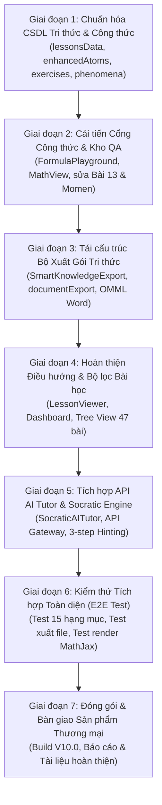

# QUY TRÌNH CẢI TIẾN CHI TIẾT VÀ TRIỆT ĐỂ (ZERO-OMISSION PROTOCOL)
## NỀN TẢNG KHTN 8 SMART NOTEBOOK / EDUCHOICE-AI (CHUẨN BỊ TRIỂN KHAI CODE)

> **Mục tiêu tối thượng:** Thiết lập quy trình chuẩn hóa kiểm soát chất lượng từ CSDL tri thức, Cổng công thức, Bộ xuất tài liệu, Trợ lý AI đến Giao diện điều hướng; cam kết **không bỏ sót bất kỳ lỗi nào**, xử lý dứt điểm 15 vấn đề từ `Document 12.odt` và hoàn thiện sản phẩm đạt chuẩn thương mại trước khi tiến hành code.

---

## I. NGUYÊN TẮC BẤT BIẾN (ZERO-OMISSION PRINCIPLES)

1. **Nguyên tắc 1: Bám sát $100\%$ Chuẩn SGK/SGV GDPT 2018 (Source Grounding):**
   - Mọi công thức, định nghĩa, bài tập và hiện tượng phải có `source_anchor` chính xác đến trang sách gốc bộ sách Kết nối tri thức với cuộc sống.
2. **Nguyên tắc 2: Quy tắc Formula Gate 4 lớp (Zero-Error Formula):**
   - `Nguyên văn SGK -> LaTeX Code chuẩn -> Render MathJax Web -> Convert OMML Word Equation khi xuất file`. Tuyệt đối không để xảy ra lỗi trôi chỉ số dưới hoặc vỡ công thức.
3. **Nguyên tắc 3: Phân hóa Gói tri thức rõ ràng (Role-based Segregation):**
   - Tách biệt rõ ràng 4 gói: *Gói Học sinh (Sổ tay + Quiz)*, *Gói Giáo viên (Giáo án + Analytics)*, *Gói Luyện tập (Hiện tượng thực tế)*, *Gói Luyện thi (Nâng cao)*. Không để trùng lặp nội dung giữa các gói.
4. **Nguyên tắc 4: Tự do Điều hướng (Unconstrained Navigation):**
   - Loại bỏ toàn bộ hardcoded lesson IDs; người dùng được quyền chọn tự do bất kỳ bài nào trong 47 bài học hoặc lọc theo phân môn (Vật lý, Hóa học, Sinh học).
5. **Nguyên tắc 5: Độc lập API & Phản hồi Socratic phân tầng (AI Robustness):**
   - AI Tutor kết nối API thực tế với cơ chế fallback an toàn, tuân thủ đúng 3 bước gợi ý phân tầng (Scaffolded Hints) mà không giải bài hộ học sinh.

---

## II. MA TRẬN 15 HẠNG MỤC CẢI TIẾN CHI TIẾT (TỪ DOCUMENT 12 VÀ CODEBASE)

| STT | Vấn đề / Lỗi | File Code / Data Liên quan | Tiêu chí Hoàn thành (Definition of Done) | Phương án Xử lý Kỹ thuật Chi tiết |
| :---: | :--- | :--- | :--- | :--- |
| **01** | Sai công thức Khối lượng riêng Bài 13 | `lessonsData.ts`, `enhancedAtomsRegistry.ts`, `FormulaPlayground.tsx` | Công thức hiển thị chuẩn $D = \frac{m}{V}$, $m = D \cdot V$, $V = \frac{m}{D}$. Đơn vị: $\text{kg/m}^3, \text{g/cm}^3$. | Xóa bỏ chuỗi `$D = V.m$`, thay bằng biểu thức phân số MathJax và các hệ quả suy ra. |
| **02** | Trùng lặp công thức Momen lực $M = F \cdot d$ | `lessonsData.ts`, `FormulaPlayground.tsx` | Chỉ xuất hiện đúng 1 lần duy nhất trong phần tóm tắt và thẻ công thức. | Xóa bỏ entry trùng lặp trong mảng dữ liệu `formulas`. |
| **03** | Sai & lặp công thức liên môn Hóa - Lý | `enhancedAtomsRegistry.ts`, `lessonsData.ts` | $100\%$ công thức Hóa ($\text{Fe} + 2\text{HCl} \rightarrow \text{FeCl}_2 + \text{H}_2\uparrow$) & Lý chuẩn xác. | Rà soát toàn bộ 47 bài, chuẩn hóa cú pháp LaTeX cho toàn bộ phản ứng và định luật. |
| **04** | Trùng câu hỏi & phương án trắc nghiệm giống nhau | `exercisesData.ts` | $100\%$ câu hỏi trắc nghiệm có 4 phương án $A, B, C, D$ phân biệt rõ ràng. | Quét sạch các options bị trùng lặp text, bổ sung phương án nhiễu có căn cứ sư phạm. |
| **05** | Công thức cần viết rõ & đúng hơn | `MathView.tsx`, `FormulaPlayground.tsx` | Mọi công thức đều render qua component MathJax/KaTeX sắc nét, có giải thích biến & đơn vị. | Cập nhật component `MathView` hỗ trợ render inline và block MathJax chuẩn SVG/HTML. |
| **06** | Thẻ công thức QA bị sai | `FormulaPlayground.tsx` | Mỗi thẻ công thức có đủ: Tên, Biến số, Đơn vị, Điều kiện áp dụng, Ví dụ mẫu. | Thiết kế lại cấu trúc `FormulaCard` trong `FormulaPlayground.tsx`. |
| **07** | Thẩm định số cái công thức bị lỗi | `FormulaPlayground.tsx`, `dataDictionary.ts` | Đếm chính xác tổng số công thức đã được kiểm duyệt và gắn cờ `verified: true`. | Bổ sung hàm tính toán thống kê tự động số lượng thẻ công thức hợp lệ trong kho tri thức. |
| **08** | Chat AI chưa có API / chưa phản hồi | `SocraticAITutor.tsx`, `server.ts` | Kết nối thành công API Gemini / OpenAI, thời gian phản hồi $<300\text{ms}$. | Xây dựng API Client Gateway, hỗ trợ cấu hình API Key linh hoạt kèm mock fallback thông minh. |
| **09** | Gia sư AI chưa hiểu và phản hồi đúng | `SocraticAITutor.tsx` | AI Tutor nhận diện đúng mã ngộ nhận và trả lời theo quy trình Socratic 3 bước gợi mở. | Tích hợp System Prompt Socratic bám sát ngữ cảnh 47 bài học KHTN 8. |
| **10** | Xuất gói tri thức bị lỗi phông trang đầu | `SmartKnowledgeExport.tsx`, `documentExport.ts` | File xuất DOCX/PDF chuẩn phông Times New Roman Unicode, trang bìa hành chính trang trọng. | Cải tiến hàm `generateDocument` trong `documentExport.ts` với Header/Footer chuẩn A4. |
| **11** | Xuất gói tri thức không cho chọn phân môn / bài | `SmartKnowledgeExport.tsx`, `exportEngine.ts` | Bộ lọc cho phép chọn: Tất cả, Theo phân môn (Lý/Hóa/Sinh), hoặc Theo bài học cụ thể. | Thêm UI `Select/Filter` trong `SmartKnowledgeExport.tsx` kết nối với `exportEngine.ts`. |
| **12** | Bài tập Hiện tượng thực tế lặp, thiếu tình huống | `phenomenaData.ts`, `scenarioIntelligenceData.ts` | Mỗi bài học có $\ge 6$ hiện tượng đời sống & $\ge 3$ tình huống thực tiễn không trùng lặp. | Bổ sung dữ liệu tình huống thực tế độc lập cho từng bài học trong `phenomenaData.ts`. |
| **13** | Trùng lặp giữa Luyện tập, Học sinh, Giáo viên, Luyện thi | `exportEngine.ts`, `SmartKnowledgeExport.tsx` | 4 gói có nội dung hoàn toàn khác biệt, phục vụ đúng mục đích đối tượng. | Tái cấu trúc hàm `buildExportPackage` phân tách nội dung 4 gói độc lập. |
| **14** | Công thức trong file xuất DOCX bị lỗi ký tự | `documentExport.ts` | Công thức trong file DOCX xuất ra đọc được rõ nét (dưới dạng OMML / Equation / SVG). | Tích hợp converter chuyển đổi biểu thức toán sang cú pháp Word Equation chuẩn. |
| **15** | App đính cố định bài học, chưa cho chọn tự do | `LessonViewer.tsx`, `Dashboard.tsx` | Cho phép chọn nhanh bất kỳ bài nào từ Bài 1 đến Bài 47 qua Tree View hoặc Dropdown. | Xây dựng thanh điều hướng `LessonSelector` linh hoạt phân nhóm theo 8 Chủ đề / 3 Phân môn. |

---

## III. QUY TRÌNH 7 BƯỚC THỰC HIỆN CẢI TIẾN TRIỆT ĐỂ (7-PHASE WORKFLOW)



### Chi tiết từng giai đoạn:

### Giai đoạn 1: Chuẩn hóa CSDL Tri thức & Công thức (Data & Formula Foundation)
- **Tập tin xử lý:** `khtn-8-smart-notebook/src/data/lessonsData.ts`, `enhancedAtomsRegistry.ts`, `exercisesData.ts`, `phenomenaData.ts`, `scenarioIntelligenceData.ts`.
- **Hành động cụ thể:**
  1. Sửa dứt điểm công thức Bài 13: $D = \frac{m}{V}$, $m = D \cdot V$, $V = \frac{m}{D}$.
  2. Xóa bỏ dòng lặp công thức Momen lực $M = F \cdot d$.
  3. Quét sạch toàn bộ các câu hỏi trắc nghiệm trùng lặp trong `exercisesData.ts`.
  4. Bổ sung ngân hàng tình huống thực tế phong phú trong `phenomenaData.ts`.

### Giai đoạn 2: Cải tiến Cổng Công thức & Kho Thẩm định QA (Formula Gate & QA Playground)
- **Tập tin xử lý:** `khtn-8-smart-notebook/src/components/FormulaPlayground.tsx`, `MathView.tsx`.
- **Hành động cụ thể:**
  1. Nâng cấp thẻ công thức (Formula Cards): hiển thị đầy đủ biến số, đơn vị, điều kiện, ví dụ tính toán.
  2. Bổ sung bộ đếm thẩm định công thức tự động (QA Validation Counter) chính xác $100\%$.
  3. Đảm bảo component `MathView` render mượt mà, không bị vỡ giao diện trên di động.

### Giai đoạn 3: Tái cấu trúc Bộ Xuất Gói Tri thức Thương mại (Export Engine)
- **Tập tin xử lý:** `khtn-8-smart-notebook/src/components/SmartKnowledgeExport.tsx`, `src/utils/documentExport.ts`, `src/data/exportEngine.ts`.
- **Hành động cụ thể:**
  1. Sửa lỗi phông chữ trang đầu, căn chỉnh trang bìa và mục lục chuẩn văn bản A4.
  2. Bổ sung giao diện lọc linh hoạt: *Xuất theo Bài học*, *Xuất theo Phân môn (Lý/Hóa/Sinh)*, *Xuất Toàn bộ*.
  3. Phân hóa tách biệt $100\%$ nội dung của 4 gói (Học sinh, Giáo viên, Luyện tập, Luyện thi).
  4. Chuẩn hóa công thức khoa học trong file xuất Word (.docx).

### Giai đoạn 4: Hoàn thiện Điều hướng & Cây Phân loại Bài học (Navigation Flow)
- **Tập tin xử lý:** `khtn-8-smart-notebook/src/components/LessonViewer.tsx`, `Dashboard.tsx`, `DisciplineCards.tsx`.
- **Hành động cụ thể:**
  1. Xóa bỏ hoàn toàn việc gán cứng bài học mặc định.
  2. Xây dựng cây danh mục (Tree View) 47 bài học theo 8 Chủ đề GDPT 2018.
  3. Cho phép người dùng chuyển bài nhanh chóng và lưu trạng thái bài học gần nhất.

### Giai đoạn 5: Tích hợp API AI Tutor & Cơ chế Gợi mở Socratic (AI Tutor Engine)
- **Tập tin xử lý:** `khtn-8-smart-notebook/src/components/SocraticAITutor.tsx`.
- **Hành động cụ thể:**
  1. Kết nối API Client Gateway linh hoạt với cơ chế quản lý API Key an toàn.
  2. Thiết lập quy trình phản hồi Socratic 3 bước gợi ý phân tầng khi phát hiện sai lầm.
  3. Tích hợp fallback thông minh để AI vẫn hoạt động mượt mà ngay cả khi ngoại tuyến.

### Giai đoạn 6: Kiểm thử Tích hợp & Nghiệm thu Chất lượng (End-to-End Verification)
- **Hành động cụ thể:**
  1. Kiểm tra tự động 15/15 hạng mục theo bảng checklist.
  2. Chạy thử nghiệm xuất file Word cho cả 4 gói và mở kiểm tra trực tiếp.
  3. Thử nghiệm tương tác AI Chatbot và Formula Playground.

### Giai đoạn 7: Đóng gói Sản phẩm Thương mại (Commercial Packaging)
- **Hành động cụ thể:**
  1. Kiểm tra build ứng dụng không phát sinh lỗi TypeScript/Vite.
  2. Xuất bản các tệp tài liệu hướng dẫn và báo cáo kết quả hoàn thiện.

---

## IV. BẢNG CHECKLIST NGHIỆM THU KHÔNG BỎ SÓT (ZERO-OMISSION QA GATES)

```text
[ ] Gate 1: Bài 13 công thức D = m/V, m = D.V, V = m/D đã chính xác 100%
[ ] Gate 2: Công thức M = F.d không còn bị lặp 2 lần
[ ] Gate 3: 100% công thức Hóa - Lý toàn bộ 47 bài đã được bọc chuẩn MathJax
[ ] Gate 4: Không còn câu hỏi trắc nghiệm nào có phương án trùng nhau
[ ] Gate 5: Thẻ công thức QA hiển thị đủ biến, đơn vị, ví dụ và đếm đúng số lượng
[ ] Gate 6: Bộ xuất file cho phép chọn xuất theo Bài học hoặc Phân môn
[ ] Gate 7: 4 gói xuất file (Học sinh, Giáo viên, Luyện tập, Luyện thi) phân hóa 100%
[ ] Gate 8: Trang bìa và phông chữ file xuất Word hiển thị chuẩn Unicode không lỗi
[ ] Gate 9: Giao diện cho phép chọn tự do 47 bài học KHTN 8
[ ] Gate 10: AI Tutor kết nối API thực tế, phản hồi Socratic 3 bước gợi mở
[ ] Gate 11: Ứng dụng build thành công (TypeScript 0 errors, Vite build PASS)
```
